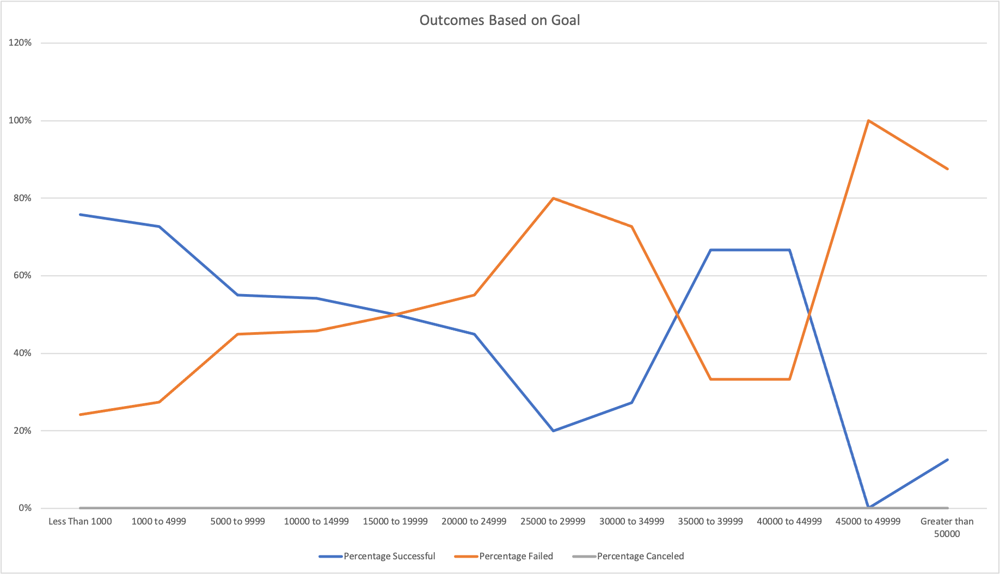

# Kickstarting with Excel

## Overview of Project
A client came to us and requested help on determining if there is a good time of year and funding level to launch a successful Kickstarter for her play. We provided analysis of Kickstarter campaign data that clearly showed the data requested by the client.  

### Purpose
The purpose was to do meaningful analysis of data provided and filter to only data relevant to the client's specific needs. 

### Analysis of Outcomes Based on Launch Date
There are definitely better months to launch your campaign. It isn’t immediately clear as to why that is, but May is the most successful month with June and July being the next best options. It would be good to avoid November and December as those are the least successful months. 

### Analysis of Outcomes Based on Goals
Again, there is some obvious correlation between how much funding is asked for and the chance of success. While there are many successful campaigns across the funding range, there is the greatest chance for success (over 70%!) if your goal is $5000 or less. 
 

### Challenges and Difficulties Encountered
This was easy data to work with, meaning that is was easy to see correlation of successful Kickstarters and when they were launched and how much funding they asked for. There wasn't a lot of data cleanup needed to make that visible. The formulas needed to do this work were fairly basic, but hinted at future complexities when the data isn't so easily cleaned up. This data was also very easy to interpret, but I could foresee situations where it isn’t so obvious on a graph or in a chart that there are clear answers to your questions. 

## Results

What are two conclusions you can draw about the Outcomes based on Launch Date? 
May through July is the best time to launch your Kickstarter campaign. November and December are the worst months to launch. 

What can you conclude about the Outcomes based on Goals? 
There are successful and failed campaigns throughout the goal range, but you are more likely to be successful if you are asking for $5000 or less. 

What are some limitations of this dataset? 
This data isn’t completely up to date so the conclusions may not be completely accurate to today. It doesn’t show if any of the campaigns offered donation perks or stretch goals that made donations more likely.

What are some other possible tables and/or graphs that we could create? 
We could create tables and graphs that show if there is any correlation between campaign success and what country the campaign was launched in. We could also look to see if there is any correlation between the campaign being spotlighted or a staff pick and the campaign being successful.
